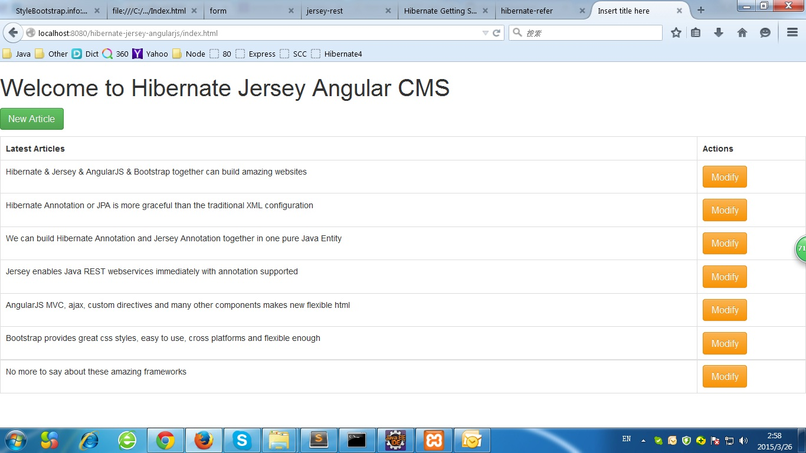

# hibernate-jersey-angularjs
hibernate-jersey-angularjs-bootsrap quickstart demo

Setup:

1. git clone https://github.com/jimuyouyou/hibernate-jersey-angularjs.git

2. mvn clean compile

3. mvn eclipse:eclipse

4. Open eclipse > Import as existing maven project

5. edit hibernate.cfg.xml to use your own mysql db, username and password

6. Right click on project name > Run on server

7. http://localhost:8080/hibernate-jersey-angularjs/

Notes:

1. For testing reason, hibernate.cfg.xml is located in both src(Java app testing) and webapp(servlet based testing)

screenshot:

</img>